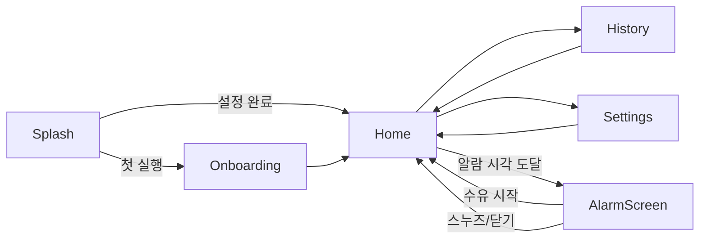

# 쪽쪽 (zzokzzok) — 기획서

> 아기 수유 시작/종료를 한 번의 탭으로 기록하고, 수유가 끝난 뒤 설정한 시간이 지나면
> **"OO아~ 맘마먹자"** 알림으로 다음 수유 시간을 알려주는 앱.

| 항목 | 내용 |
|---|---|
| 앱 이름 | 쪽쪽 (영문 ID: `zzokzzok`, 패키지 `com.zzokzzok.app`) |
| 버전 | 0.1.0 (MVP) |
| 플랫폼 | Android(APK), iOS(동일 코드, Xcode 빌드), PWA(브라우저·홈화면 설치) |
| 기술 스택 | React 19 + TypeScript + Vite, Capacitor 8 (네이티브 래핑 / 로컬 알림), Vitest |
| 작성일 | 2026-09-23 |

---

## 1. 배경과 문제

- 신생아는 보통 2~4시간 간격으로 수유하지만, 새벽 수유를 반복하다 보면 **"마지막 수유가 언제 끝났는지"** 와 **"다음 수유가 언제인지"** 를 놓치기 쉽다.
- 기존 육아 앱은 기능이 너무 많아(체온, 배변, 성장곡선…) 새벽 3시에 한 손으로 조작하기 어렵다.
- 필요한 것은 딱 세 가지: **시작 버튼, 종료 버튼, 그리고 제때 울리는 알람.**

## 2. 목표

1. 수유 시작·종료를 각각 **한 번의 탭**으로 기록한다.
2. 수유 종료 시각 + 설정 간격(분)에 **정확히** 알람을 보낸다. 앱이 꺼져 있어도 울려야 한다.
3. 알람 문구는 아기 이름을 불러주는 형태 `"{이름}아~ 맘마먹자"` 로 한다.
4. 어떤 기기에서도 설치할 수 있다 (Android APK / iOS / PWA).

## 3. 타깃 사용자와 시나리오

**주 사용자**: 생후 0~12개월 아기를 돌보는 양육자(엄마·아빠·조부모·돌봄 선생님).

### 대표 시나리오 — 새벽 3시
1. 아기가 울어 잠에서 깬다. 폰을 켜고 쪽쪽을 연다. 화면은 어둡고 따뜻한 톤(눈부심 최소화).
2. 화면 하단의 큰 **"수유 시작"** 버튼을 누른다. 시작 시각이 기록되고 경과 타이머가 돈다.
3. 수유가 끝나면 **"수유 종료"** 를 누른다. 기록이 저장되고 "05:40에 알려드릴게요" 토스트가 뜬다.
4. 폰을 내려놓고 잔다. 앱은 종료되어도 상관없다.
5. 05:40, 폰에 **"지민아~ 맘마먹자"** 알림이 울린다. 알림을 누르면 앱이 열리고 바로 "수유 시작" 을 누를 수 있다.

### 부가 시나리오
- 배우자가 교대 수유: 같은 폰을 쓰거나, 각자 폰에 설치(MVP는 기기 간 동기화 없음).
- 아기가 아직 안 깨서 조금 미루고 싶음 → 알람 화면에서 **"10분 뒤 다시"**.
- 하루 수유 횟수·총 시간을 소아과 진료 시 참고 → **기록 탭 요약**.

## 4. 기능 요구사항 (FR)

| ID | 기능 | 상세 | 우선순위 |
|---|---|---|---|
| FR-01 | 아기 이름 설정 | 1~12자. 첫 실행 온보딩에서 필수 입력, 설정에서 변경 가능 | P0 |
| FR-02 | 알람 간격 설정 | 수유 **종료** 기준 N분 뒤. 범위 5~720분, 기본 180분. 프리셋(90/120/150/180/240) + 직접 입력 | P0 |
| FR-03 | 수유 시작 | 탭 즉시 시작 시각 기록, 경과 시간(mm:ss) 실시간 표시. 시작 시 예약된 알람은 취소 | P0 |
| FR-04 | 수유 종료 | 종료 시각 기록, 소요시간 계산·저장. 종료 시각은 시작 시각 이후여야 함 | P0 |
| FR-05 | 알람 예약 | 예약 시각 = 종료 시각 + 간격. 예약 직후 "HH:mm에 알려드릴게요" 안내 | P0 |
| FR-06 | 알람 문구 | `"{이름}아~ 맘마먹자"`. 이름 마지막 글자에 받침이 있으면 "아", 없으면 "야" (수아→수아야, 지민→지민아). 한글이 아니면 "아" | P0 |
| FR-07 | 알림 전달 | 네이티브 로컬 알림(Android AlarmManager exact / iOS UNUserNotificationCenter). 앱 종료·화면 꺼짐 상태에서도 도착. 웹(PWA)은 앱이 열려 있을 때 Notification API + 화면 내 알람 | P0 |
| FR-08 | 알람 화면 | 알람 시각 도달 시 앱이 열려 있으면 전체 화면 알람(문구·진동·소리). 앱 재진입 시 지난 알람이 있으면 알람 화면 표시 | P0 |
| FR-09 | 스누즈 | "10분 뒤 다시" → 현재 시각 + 10분으로 재예약 (횟수 제한 없음) | P1 |
| FR-10 | 알람 해제 | 알람 화면에서 "수유 시작" → 알람 해제 + 수유 시작. "닫기" → 알람만 해제 | P0 |
| FR-11 | 수유 기록 목록 | 날짜별 그룹, 시작~종료 시각, 소요시간, 종류. 항목 삭제(확인 후) | P0 |
| FR-12 | 오늘 요약 | 오늘 수유 횟수, 총 수유 시간, 평균 간격(직전 종료→다음 시작) | P1 |
| FR-13 | 수유 종류 | 모유 / 분유 / 이유식 중 선택 (기본: 마지막 선택값, 최초 모유) | P1 |
| FR-14 | 데이터 영속 | 앱 재시작·재부팅 후에도 설정·기록·진행 중 수유·예약 알람 유지 | P0 |
| FR-15 | 알림 권한 | 온보딩에서 권한 요청. 거부 시 홈 상단에 안내 배너 + 설정 이동 버튼 | P0 |
| FR-16 | 테스트 알림 | 설정에서 "알림 미리보기" → 5초 뒤 실제 문구로 알림 발송 | P1 |
| FR-17 | 데이터 초기화 | 설정에서 모든 기록 삭제(2단계 확인) | P2 |
| FR-18 | 시작 시각 보정 | 수유 중 화면에서 시작 시각을 ±분 단위로 수정(앱 켜기 전에 시작한 경우) | P1 |

## 5. 비기능 요구사항 (NFR)

| ID | 항목 | 기준 |
|---|---|---|
| NFR-01 | 한 손 조작 | 주요 버튼은 화면 하단, 높이 ≥ 56dp, 엄지 도달 범위 |
| NFR-02 | 야간 사용 | 다크 테마 기본 지원(시스템 설정 연동), 순백 배경 금지 |
| NFR-03 | 즉시성 | 시작/종료 탭 → 화면 반영 < 100ms, 타이머 1초 주기 갱신 |
| NFR-04 | 오프라인 | 네트워크 없이 모든 기능 동작 (폰트 포함 번들) |
| NFR-05 | 알람 정확도 | 예약 시각 ± 1분 이내 도착 (Android exact alarm, `USE_EXACT_ALARM`) |
| NFR-06 | 접근성 | 모든 버튼 aria-label, 색 대비 4.5:1 이상, 글자 크기 ≥ 14px |
| NFR-07 | 테스트 | 도메인 로직 100% 단위 테스트, 핵심 화면 흐름 컴포넌트 테스트 |
| NFR-08 | 개인정보 | 서버 없음. 모든 데이터는 기기 내 저장 |

## 6. 알림 정책

```
알람 예약 시각 = 수유 종료 시각 + 간격(분)
```

| 상황 | 동작 |
|---|---|
| 수유 종료 | 기존 예약 취소 후 새로 예약 (항상 1개만 존재) |
| 수유 시작 | 예약 취소 (수유 중에는 알람 불필요) |
| 스누즈 | 예약 취소 후 `now + 10분` 으로 재예약 |
| 알람 닫기 | 예약 제거, 다음 수유 종료까지 알람 없음 |
| 간격 변경 | 예약이 있으면 `마지막 종료 시각 + 새 간격` 으로 재계산. 이미 지난 시각이면 즉시 알람 |
| 앱 재진입 | `scheduledAt <= now` 이면 알람 화면 표시 (OS 알림을 놓친 경우 대비) |
| 재부팅 | Android: 플러그인이 BOOT_COMPLETED 수신 후 복원. iOS: 시스템이 보존 |

알림 ID는 항상 `1`(다음 수유), `2`(테스트 알림)로 고정하여 중복을 막는다.

## 7. 문구 규칙

| 이름 | 받침 | 문구 |
|---|---|---|
| 지민 | 있음 | 지민아~ 맘마먹자 |
| 수아 | 없음 | 수아야~ 맘마먹자 |
| 하율 | 있음(ㄹ) | 하율아~ 맘마먹자 |
| Lily | 한글 아님 | Lily아~ 맘마먹자 |
| (미설정) | — | 아가야~ 맘마먹자 |

알림 제목: `쪽쪽 🍼` / 본문: 위 문구. 앱 내 알람 화면에는 본문을 크게 표시.

## 8. 데이터 모델

```ts
type FeedingType = 'breast' | 'bottle' | 'solid';

interface Settings {
  babyName: string;          // FR-01
  intervalMinutes: number;   // FR-02, 5~720
  lastFeedingType: FeedingType;
  sound: boolean;
  vibrate: boolean;
}

interface FeedingSession {
  id: string;                // uuid
  startedAt: number;         // epoch ms
  endedAt: number | null;    // 진행 중이면 null
  type: FeedingType;
}

interface AlarmState {
  scheduledAt: number | null; // epoch ms, 없으면 null
  snoozeCount: number;
  ringing: boolean;           // 앱 내 알람 화면 표시 여부
}

interface AppState {
  version: 1;
  onboarded: boolean;
  settings: Settings;
  current: FeedingSession | null;   // 진행 중 수유
  sessions: FeedingSession[];       // 완료된 수유, 최신순
  alarm: AlarmState;
}
```

저장소: Capacitor Preferences(네이티브) / localStorage(웹). 키 `zzokzzok.state.v1`.

## 9. 화면 구성



| 화면 | 역할 |
|---|---|
| 온보딩 | 이름 입력 → 간격 선택 → 알림 권한 요청 (3단계) |
| 홈 | 상태별 3가지 모드: **대기**(다음 알람 카운트다운 + 수유 시작), **수유 중**(경과 타이머 + 종류 + 종료), **알람**(문구 + 스누즈/시작) |
| 기록 | 오늘 요약 카드 + 날짜별 리스트 |
| 설정 | 이름, 간격, 소리/진동, 알림 미리보기, 데이터 초기화, 앱 정보 |

## 10. 플랫폼 및 배포 경로

| 경로 | 산출물 | 빌드 위치 | 비고 |
|---|---|---|---|
| Android | `app-debug.apk` / `app-release.apk` | 이 저장소 (`npm run android:apk`) | 알림: 로컬 알림 + exact alarm |
| iOS | Xcode 프로젝트 `ios/` | macOS + Xcode 필요(Apple 정책) | `npx cap open ios` → 실행/아카이브 |
| PWA | `dist/` 정적 파일 | 이 저장소 (`npm run build`) | 아이폰 Safari "홈 화면에 추가", 데스크톱 설치 |

## 11. 범위 밖 (MVP 이후)

- 기기 간 동기화 / 가족 공유 계정
- 수유량(ml) 입력, 좌/우 젖 기록, 배변·수면 기록
- 위젯, 워치 앱, 잠금화면 라이브 액티비티
- 통계 차트(주간/월간)
- 다국어

## 12. 성공 지표

- 시작→종료→알람 예약까지 탭 3회 이하
- 알람 도착 정확도 ±1분 (실기기 검증)
- 단위 테스트 전부 통과, 도메인 로직 커버리지 ≥ 95%
