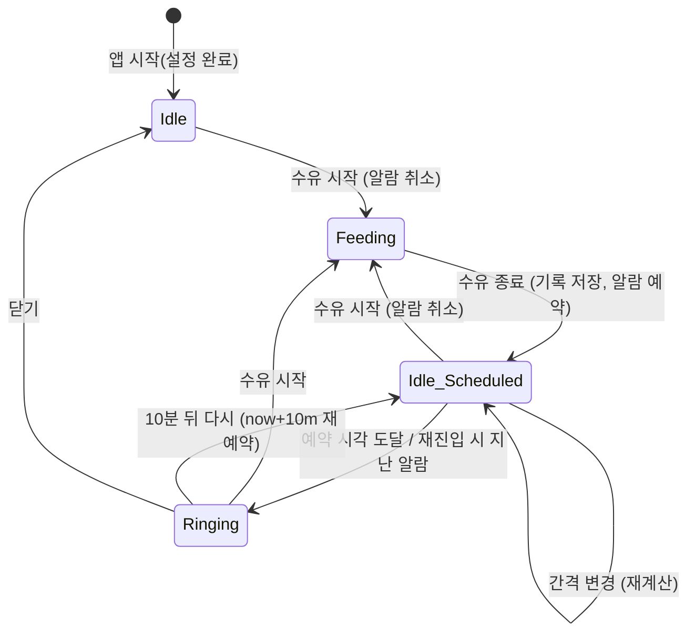

# 쪽쪽 — 프로토타입 & 화면 설계

클릭 가능한 저충실도 프로토타입: [`docs/prototype/index.html`](prototype/index.html) (브라우저로 열기)

---

## 1. 디자인 컨셉: "새벽 조명"

새벽 수유의 순간에 맞춘 **어둡고 따뜻한 밤 조명** 톤. 눈부시지 않되 필요한 정보(남은 시간, 경과 시간)는 크게.
낮에는 시스템 설정을 따라 크림색 라이트 테마로 자동 전환.

### 디자인 토큰

| 토큰 | 다크(기본) | 라이트 | 용도 |
|---|---|---|---|
| `--bg` | `#1e1a2a` | `#fff6ea` | 배경 |
| `--bg-2` | `#2a2438` | `#fdebd6` | 카드/시트 |
| `--ink` | `#fff1e2` | `#2d2233` | 본문 텍스트 |
| `--ink-2` | `#b9aec4` | `#7a6a80` | 보조 텍스트 |
| `--accent` | `#ffa25b` | `#f0803a` | 주 액션(수유 시작), 링 |
| `--accent-2` | `#ffb8c8` | `#e8829c` | 알람/강조 |
| `--mint` | `#9fe3c5` | `#2f9c73` | 완료/종료 |
| `--line` | `rgba(255,241,226,.12)` | `rgba(45,34,51,.12)` | 구분선 |
| `--radius` | `28px` | | 카드·버튼 |
| `--font-display` | `"Jua"` | | 숫자, 제목, 알람 문구 |
| `--font-body` | `"Gowun Dodum"` | | 본문 |

- 배경에는 아주 옅은 노이즈 텍스처 + 상단 모서리에서 퍼지는 따뜻한 라디얼 글로우.
- 큰 원형 링(진행률)이 홈의 중심. 수유 중에는 링이 숨쉬듯 천천히 맥동.
- 주 액션 버튼은 화면 하단 고정, 높이 64px, 알약(pill) 형태.

## 2. 상태 머신



- `Idle` = 예약 알람 없음, `Idle_Scheduled` = 예약 알람 있음. UI 상으로는 둘 다 "대기" 모드이며 카운트다운 카드 유무만 다르다.
- `Ringing` 은 `alarm.ringing === true`.

## 3. 화면 와이어프레임

### 3.1 온보딩 (3단계)

```
┌──────────────────────────────┐   ┌──────────────────────────────┐   ┌──────────────────────────────┐
│  🍼 쪽쪽                      │   │  ← 2/3                        │   │  ← 3/3                        │
│                              │   │                              │   │                              │
│  아기 이름이 뭐예요?           │   │  수유 끝나고 몇 분 뒤에        │   │  알림을 허용해 주세요          │
│                              │   │  알려드릴까요?                 │   │                              │
│  ┌────────────────────────┐  │   │                              │   │  "지민아~ 맘마먹자"           │
│  │ 지민                    │  │   │  [90] [120] [150] [180] [240]│   │  이렇게 알려드려요.            │
│  └────────────────────────┘  │   │                              │   │                              │
│  → "지민아~ 맘마먹자" 로      │   │  직접 입력 [ 180 ] 분         │   │                              │
│     불러드릴게요              │   │                              │   │                              │
│                              │   │                              │   │                              │
│        ( 다음 )               │   │        ( 다음 )               │   │   ( 알림 허용하고 시작 )       │
└──────────────────────────────┘   └──────────────────────────────┘   │   나중에 할게요                │
                                                                      └──────────────────────────────┘
```

### 3.2 홈 — 대기 (Idle / Idle_Scheduled)

```
┌──────────────────────────────┐
│ 쪽쪽            [기록] [설정] │
│ (⚠ 알림이 꺼져 있어요 → 설정) │  ← 권한 거부 시에만
│                              │
│      ╭────────────────╮      │
│    ╭─╯  다음 맘마까지  ╰─╮    │
│   │      1:23:45         │   │  ← 큰 링, 남은 비율만큼 채움
│   │   05:40 에 알려요     │   │     예약 없으면 "수유를 시작해 보세요"
│    ╰─╮                ╭─╯    │
│      ╰────────────────╯      │
│                              │
│  마지막 수유  02:10 ~ 02:32   │
│  22분 · 모유                  │
│                              │
│  ┏━━━━━━━━━━━━━━━━━━━━━━━━┓  │
│  ┃      🍼  수유 시작       ┃  │  ← 하단 고정, accent
│  ┗━━━━━━━━━━━━━━━━━━━━━━━━┛  │
└──────────────────────────────┘
```

### 3.3 홈 — 수유 중 (Feeding)

```
┌──────────────────────────────┐
│ 쪽쪽            [기록] [설정] │
│                              │
│      ╭────────────────╮      │
│    ╭─╯    수유 중      ╰─╮    │
│   │       12:34          │   │  ← 경과 mm:ss, 링 맥동
│   │  02:10 부터   [-5][+5]│   │  ← FR-18 시작 시각 보정
│    ╰─╮                ╭─╯    │
│      ╰────────────────╯      │
│                              │
│   (● 모유)  ( 분유 )  ( 이유식 )│  ← FR-13
│                              │
│  ┏━━━━━━━━━━━━━━━━━━━━━━━━┓  │
│  ┃      ✓  수유 종료        ┃  │  ← mint
│  ┗━━━━━━━━━━━━━━━━━━━━━━━━┛  │
└──────────────────────────────┘
      종료 후 토스트: "05:40에 알려드릴게요 🔔"
```

### 3.4 알람 (Ringing)

```
┌──────────────────────────────┐
│                              │
│                              │
│            🍼                 │  ← 흔들리는 애니메이션
│                              │
│      지민아~ 맘마먹자          │  ← display 44px, accent-2 글로우
│                              │
│      05:40 · 예약 알람         │
│                              │
│                              │
│  ┏━━━━━━━━━━━━━━━━━━━━━━━━┓  │
│  ┃      🍼  수유 시작       ┃  │
│  ┗━━━━━━━━━━━━━━━━━━━━━━━━┛  │
│  ( 10분 뒤 다시 )   ( 닫기 )   │
└──────────────────────────────┘
```

### 3.5 기록

```
┌──────────────────────────────┐
│ ← 기록                        │
│ ┌──────────────────────────┐ │
│ │ 오늘   7회 · 2시간 14분    │ │
│ │ 평균 간격 2시간 50분        │ │
│ └──────────────────────────┘ │
│ 오늘                          │
│  02:10 – 02:32   22분  모유  ✕│
│  23:05 – 23:20   15분  분유  ✕│
│ 어제                          │
│  20:01 – 20:18   17분  모유  ✕│
│  ...                          │
└──────────────────────────────┘
```

### 3.6 설정

```
┌──────────────────────────────┐
│ ← 설정                        │
│ 아기 이름        [ 지민     ] │
│ 알람 간격        [ 180 ] 분   │
│   [90] [120] [150] [180] [240]│
│ 소리             (●)          │
│ 진동             (●)          │
│ ─────────────────────────── │
│ 알림 미리보기 (5초 뒤 발송)   │
│ 알림 권한 상태: 허용됨         │
│ ─────────────────────────── │
│ 모든 기록 삭제                │
│ 쪽쪽 v0.1.0                   │
└──────────────────────────────┘
```

## 4. 인터랙션 상세

| 상황 | 동작 | 피드백 |
|---|---|---|
| 수유 시작 탭 | `START` 디스패치, 알람 취소 | 햅틱(medium), 링 색 accent → 맥동 시작 |
| 수유 종료 탭 | `END` → 세션 저장, `scheduleAt = end + interval` 예약 | 햅틱(success), 토스트 "HH:mm에 알려드릴게요 🔔" 3초 |
| 카운트다운 | 1초마다 `remaining = scheduledAt - now` | 0 이하가 되면 `RING` |
| 앱 포그라운드 복귀 | `scheduledAt <= now && !current` → `RING` | 알람 화면 |
| 알림 탭(OS) | 앱 열림 → 위 규칙으로 알람 화면 | |
| 스누즈 | `SNOOZE` → `scheduledAt = now + 10m`, 재예약 | 토스트 "10분 뒤 다시 알려드릴게요" |
| 간격 변경(설정) | 예약 있으면 재계산 → 재예약 | 토스트 |
| 기록 삭제 | 확인 다이얼로그 → `DELETE_SESSION` | 행 제거 |
| 오프라인 | 영향 없음 | |

## 5. 컴포넌트 / 파일 구조

```
src/
  domain/                 # 순수 로직 (프레임워크 무관, 100% 테스트)
    korean.ts             # 받침 판별, 호격 조사(아/야), 알람 문구
    time.ts               # 포맷(경과, 남은 시간, HH:mm), 날짜 그룹
    feeding.ts            # 세션 생성/종료/검증, 소요시간
    alarm.ts              # 예약 시각 계산, 스누즈, due 판정
    stats.ts              # 오늘 요약(횟수·총시간·평균 간격)
    state.ts              # AppState, 초기값, reducer, 직렬화/역직렬화
  ports/                  # 플랫폼 경계 (인터페이스 + 구현)
    storage.ts            # StoragePort: Preferences(native) / localStorage(web) / memory(test)
    notifier.ts           # NotifierPort: Capacitor LocalNotifications / Web Notification / noop
    haptics.ts
  app/
    store.tsx             # useReducer + 영속화 + 알림 동기화 훅
    App.tsx               # 라우팅(화면 상태), 포그라운드 복귀 처리
  screens/
    Onboarding.tsx  Home.tsx  AlarmScreen.tsx  History.tsx  Settings.tsx
  components/
    Ring.tsx  BigButton.tsx  Toast.tsx  IntervalPicker.tsx  TypeChips.tsx
  styles/
    tokens.css  global.css
```
